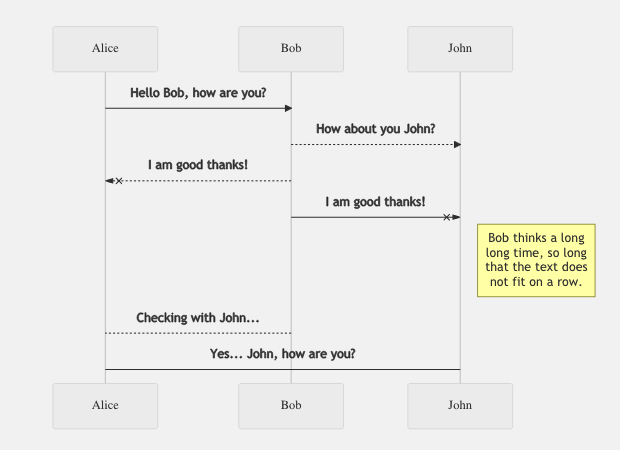

Here's why you must use Markdown for documents and notes.

<!--more-->

# Use Markdown for documents and notes

You may have heard of content management systems. These systems hold the content that you want to deliver in the form of blocks or pages or files or images. But after you’ve created the content, you need to think carefully about how that content should be delivered through different channels. That’s where content delivery comes into the picture.

Two aspects have that have redefined the content delivery experience: formatting and style.

## WYSIWYG

Microsoft Word is one such application that provides a What You See Is What You Get (WYSIWYG) experience. You click buttons to format your content in different ways, and you get to see the results of that formatting instantly. Other content delivery systems rely on tags and stylesheets to customise the content delivery experience.

## Markdown

In contrast, Markdown is a lightweight markup language that you can use to add formatting elements to plaintext text documents. If you use a chat application such as WhatsApp, then you might remember adding asterisk signs before and after text that you want to be formatted in BOLD font. Well, that’s markdown for you.

## Why Markdown

The advantage of using Markdown is that you can use any text editor application to add markdown formatting elements to your content. This makes Markdown portable and operating system, application, and file format agnostic. You can use Markdown to create and deliver documents, presentations, websites, notes, and complete technical documentation.

When you’ve created content using Markdown, you’ll need a Markdown processing application that parses the content with markdown elements and formats it to be delivered in HTML format. You can post-process this HTML to deliver your content in other formats, such as PDF.

Unfortunately, even popular note taking applications such as OneNote and Evernote do not directly support Markdown. This means that you are pretty much locked into a specific application for your notes, and have to worry about exporting notes into a format that another note taking application can import.

Having said that, some note taking applications do support Markdown. Notion, Joplin, and Cryptee, are some of the more well-known ones.

What are your thoughts about Markdown? You can test out Markdown and let me know your thoughts.

## Bonus TIP: Implement Markdown extensions using **StackEdit**

You can use a web app, **StackEdit**, to quickly extend the standard Markdown syntax by adding extra Markdown extensions.

For example, you can render LaTeX mathematical expressions using **KaTeX:**

You can also render UML diagrams using Mermaid. For example, here is a sequence diagram:

Finally, you can render a flow chart:

